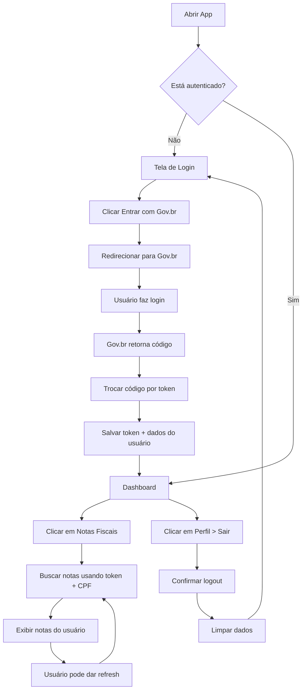

# ComprovApp - Sistema de Notas Fiscais com Login Gov.br

## 🎯 Visão Geral

O ComprovApp agora utiliza **autenticação via Gov.br** para que os usuários façam login e tenham acesso automático às suas notas fiscais eletrônicas, sem precisar digitar CPF manualmente.

## 🔐 Como Funciona

### Fluxo de Autenticação

1. **Login**: Usuário abre o app e vê a tela de login
2. **Gov.br**: Clica em "Entrar com Gov.br" e é redirecionado
3. **Autorização**: Faz login no portal Gov.br (CPF/Senha ou certificado)
4. **Token**: App recebe token de acesso OAuth2
5. **Dashboard**: Usuário é redirecionado automaticamente para o dashboard
6. **Notas**: Ao acessar "Minhas Notas Fiscais", o app busca automaticamente usando o CPF do usuário logado

### Arquitetura Implementada

```
┌─────────────────────────────────────────────────────────┐
│                      ComprovApp                         │
└─────────────────────────────────────────────────────────┘
                          │
                          ▼
        ┌─────────────────────────────────┐
        │   Login via Gov.br OAuth2       │
        │  (Autenticação Governamental)   │
        └─────────────────────────────────┘
                          │
                          ▼
        ┌─────────────────────────────────┐
        │   Token JWT + Dados do Usuário  │
        │     (CPF, Nome, Email, etc)     │
        └─────────────────────────────────┘
                          │
                          ▼
        ┌─────────────────────────────────┐
        │  Busca Automática de NF-e       │
        │   usando CPF do usuário logado  │
        └─────────────────────────────────┘
```

## 📁 Estrutura de Arquivos

```
lib/
├── main.dart                       # Ponto de entrada com AuthWrapper
├── models/
│   ├── usuario_model.dart          # Modelo do usuário autenticado
│   ├── nota_fiscal_model.dart      # Modelo de nota fiscal
│   └── purchase_model.dart
├── services/
│   ├── auth_service.dart           # Serviço de autenticação Gov.br
│   ├── nota_fiscal_service.dart    # Busca notas do usuário logado
│   └── purchase_service.dart
├── pages/
│   ├── auth/
│   │   └── login_page.dart         # Tela de login com Gov.br
│   ├── dashboard/
│   │   └── dashboard_page.dart     # Dashboard com logout
│   └── notas/
│       └── buscar_notas_page.dart  # Renomeado para MinhasNotasPage
└── components/
    ├── dashboard_header.dart
    ├── purchase_card.dart
    └── ...
```

## 🔧 Principais Mudanças

### 1. **AuthService** (`lib/services/auth_service.dart`)

Gerencia toda a autenticação:
- Login via OAuth2 com Gov.br
- Armazenamento seguro de tokens
- Renovação automática de tokens
- Verificação de autenticação
- Logout

```dart
final authService = AuthService();

// Fazer login
final usuario = await authService.login();

// Verificar se está autenticado
final isAuth = await authService.isAuthenticated();

// Obter usuário atual
final usuario = await authService.getCurrentUser();

// Fazer logout
await authService.logout();
```

### 2. **NotaFiscalService** (`lib/services/nota_fiscal_service.dart`)

Modificado para usar o usuário logado:

**ANTES:**
```dart
Future<List<NotaFiscal>> buscarNotasPorCPF(String cpf) async {
  // Buscava por qualquer CPF
}
```

**DEPOIS:**
```dart
Future<List<NotaFiscal>> buscarNotasDoUsuario(Usuario usuario) async {
  // Usa o CPF e token do usuário autenticado
  // Faz requisição autenticada à SEFAZ
}
```

### 3. **MinhasNotasPage** (`lib/pages/notas/buscar_notas_page.dart`)

**ANTES:** Tinha um formulário para digitar CPF

**DEPOIS:**
- Busca automaticamente ao abrir a tela
- Mostra informações do usuário logado
- Pull-to-refresh para atualizar
- Sem necessidade de formulário

### 4. **Main.dart** com AuthWrapper

```dart
class AuthWrapper extends StatefulWidget {
  // Verifica se o usuário está autenticado
  // Se sim → vai para Dashboard
  // Se não → vai para Login
}
```

### 5. **Dashboard** com Logout

Agora o dashboard inclui:
- Menu de perfil (botão inferior "Perfil")
- Opção de logout
- Redirecionamento para login após logout

## 🚀 Como Usar

### Para Desenvolvedores

1. **Instalar dependências:**
```bash
flutter pub get
```

2. **Executar o app:**
```bash
flutter run
```

3. **Fluxo de teste (dados simulados):**
   - Abra o app → Tela de Login
   - Clique em "Entrar com Gov.br"
   - Aguarde 2 segundos (simulação)
   - Será redirecionado para o Dashboard
   - Clique em "Notas Fiscais" na barra inferior
   - Veja as notas do usuário automaticamente

### Para Produção

Para usar em produção com a API real do Gov.br:

1. **Registrar aplicativo no Gov.br:**
   - Acesse https://sso.acesso.gov.br/
   - Cadastre seu aplicativo
   - Obtenha Client ID e Client Secret
   - Configure o redirect URI: `comprovapp://callback`

2. **Atualizar credenciais:**

   Edite `lib/services/auth_service.dart`:
   ```dart
   static const String _clientId = 'SEU_CLIENT_ID_REAL';
   static const String _clientSecret = 'SEU_CLIENT_SECRET_REAL';
   ```

3. **Configurar Deep Links:**

   **Android** (`android/app/src/main/AndroidManifest.xml`):
   ```xml
   <intent-filter>
     <action android:name="android.intent.action.VIEW" />
     <category android:name="android.intent.category.DEFAULT" />
     <category android:name="android.intent.category.BROWSABLE" />
     <data android:scheme="comprovapp" android:host="callback" />
   </intent-filter>
   ```

   **iOS** (`ios/Runner/Info.plist`):
   ```xml
   <key>CFBundleURLTypes</key>
   <array>
     <dict>
       <key>CFBundleURLSchemes</key>
       <array>
         <string>comprovapp</string>
       </array>
     </dict>
   </array>
   ```

4. **Implementar OAuth2 real:**

   Descomente e implemente os métodos em `auth_service.dart`:
   - `_buildAuthUrl()`
   - `_exchangeCodeForToken()`
   - `_getUserInfo()`

   Use o package `flutter_web_auth` ou `oauth2`:
   ```dart
   final result = await FlutterWebAuth.authenticate(
     url: _buildAuthUrl(),
     callbackUrlScheme: 'comprovapp',
   );
   ```

## 🔒 Segurança

### Armazenamento de Dados

- **Tokens**: Armazenados com `flutter_secure_storage` (criptografado)
- **Dados do usuário**: Criptografados no secure storage
- **Renovação automática**: Token renovado automaticamente quando expira

### Boas Práticas Implementadas

✅ Tokens nunca expostos no código
✅ Armazenamento seguro (Keychain no iOS, Keystore no Android)
✅ Validação de token antes de cada requisição
✅ Logout limpa todos os dados sensíveis
✅ Renovação automática de token

## 📊 Fluxo Completo



## 🆕 Novos Componentes

### Usuario Model
```dart
class Usuario {
  final String cpf;
  final String nome;
  final String? email;
  final String accessToken;
  final DateTime tokenExpiry;

  bool get tokenValido;
  String get cpfFormatado;
  String get primeiroNome;
}
```

### AuthService Methods
- `login()` - Inicia fluxo OAuth2
- `logout()` - Limpa sessão
- `isAuthenticated()` - Verifica autenticação
- `getCurrentUser()` - Retorna usuário atual
- `_renewToken()` - Renova token expirado

## 📱 Interface do Usuário

### Tela de Login
- Design moderno com gradiente
- Botão "Entrar com Gov.br" com cores oficiais
- Informações de segurança
- Loading state durante autenticação

### Dashboard
- Mantém todas as funcionalidades anteriores
- Adiciona menu de perfil
- Opção de logout
- Navegação para "Minhas Notas Fiscais"

### Minhas Notas Fiscais
- Card com informações do usuário logado
- Lista automática de notas
- Pull-to-refresh
- Botão de atualizar na AppBar
- Detalhes completos ao clicar na nota

## 🎯 Status Atual

✅ Autenticação simulada implementada
✅ Armazenamento seguro de tokens
✅ Fluxo de login/logout completo
✅ Busca automática de notas do usuário
✅ Interface modernizada
⚠️ OAuth2 real (aguardando credenciais Gov.br)
⚠️ Integração real com SEFAZ (aguardando configuração)

## 📚 Documentação Adicional

- [INTEGRACAO_NFE.md](INTEGRACAO_NFE.md) - Guia de integração com SEFAZ
- [Portal Gov.br](https://sso.acesso.gov.br/) - Registro de aplicativos
- [Documentação OAuth2](https://oauth.net/2/) - Especificação OAuth2

## 🤝 Contribuindo

Para contribuir com o projeto:

1. Implemente a autenticação OAuth2 real
2. Conecte com a API da SEFAZ usando o token do usuário
3. Adicione testes unitários
4. Melhore a UI/UX
5. Adicione cache local de notas
6. Implemente sincronização em background

## 📞 Suporte

Para dúvidas sobre:
- **Gov.br OAuth2**: https://faq-login-unico.servicos.gov.br/
- **NF-e SEFAZ**: http://www.nfe.fazenda.gov.br/
- **Flutter**: https://docs.flutter.dev/

---

**Desenvolvido com ❤️ usando Flutter**
